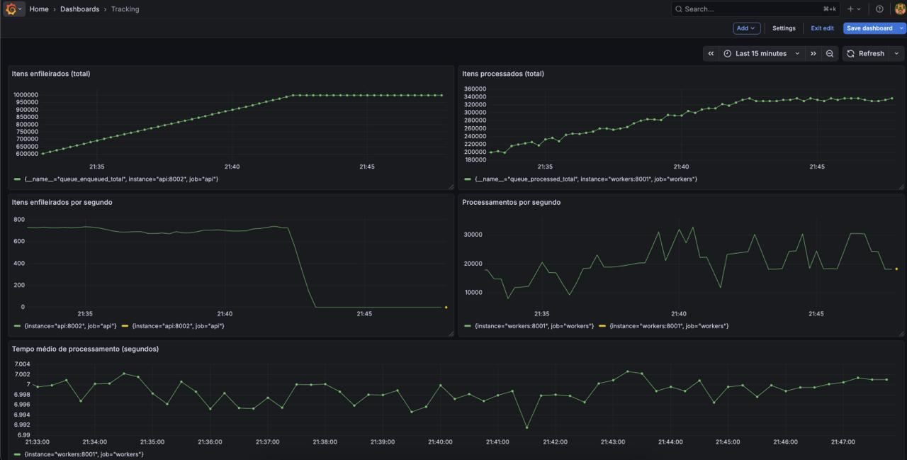

# FastAPI Queue Processing System

Infrastructure for processing tokens at scale against slow external APIs with complete observability.

## Use Case

Simulates a real-world scenario where you need to query thousands of IDs against slow external APIs (4-10s response time each). Common use cases:

- **Data enrichment** - Enrich customer data from external providers (credit bureaus, email validation, phone verification)

- **API aggregation** - Query multiple third-party APIs to consolidate information

**Example**: You have 100k user IDs that need credit score validation from an external API that takes 5-8 seconds per request. This system allows you to process them efficiently with parallel workers, retry logic, and real-time monitoring.

**Note**: The only aspect not simulated is the external API rate limiting - I still need to implement it. 

## Key Metrics & Monitoring

- **Throughput** (ok)
- **Average Latency** (ok)
- **Queue Size** - (partially ok)
- **Error Rate** - (backlog)
- **Worker Utilization** - (backlog)


## Architecture

Client → API (FastAPI) → Redis Queue → Workers (parallel) → PostgreSQL

## Quick Start

```bash
docker-compose up --build
```

**Access**: 
- API http://localhost:8000/docs
- Grafana http://localhost:3000 (user:admin/ pwd:admin)
- Prometheus http://localhost:9090

## Usage

**Enqueue token:**
```bash
curl -X POST http://localhost:8000/tokens -H "Content-Type: application/json" -d '{"token": "1234"}'
```

**Load test:**
```bash
python scripts/load_test.py --requests 1_000_000 --concurrency 5
```

## Configuration (.env)

```env
WORKER_CONCURRENCY=50      # Workers per container
QUEUE_BATCH_SIZE=100       # Processing batch size  
MAX_RETRIES=3              # Max retry attempts per token
RETRY_DELAY_MINUTES=5      # Token retry delay
```

## Scaling

**Horizontal**: `docker-compose up --scale workers=3`

**Vertical**: Edit `.env` with `WORKER_CONCURRENCY` and `QUEUE_BATCH_SIZE`

**Performance**: 10k+ tokens/s with 50 vertical workers, 3 horizontal workers and 100 batch size



## Dead Letter Queue
Failed tokens go to DLQ with automatic retry after 5 minutes (max 3 retries). 

